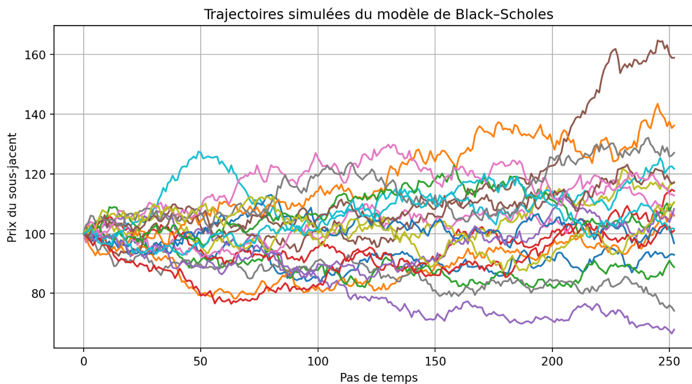
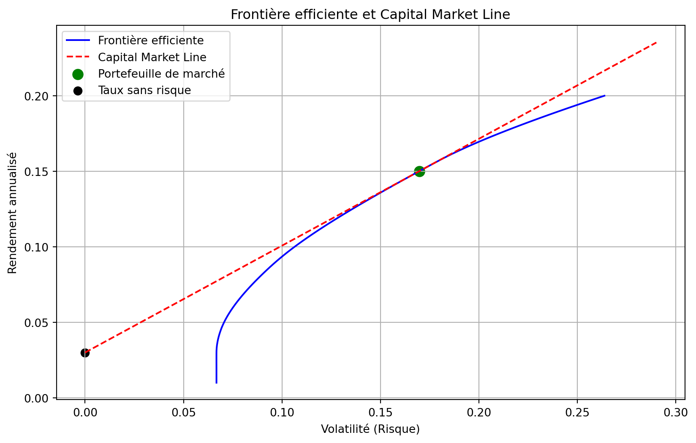

### Partie I — Cadre théorique

---

#### 📘 Chapitres disponibles

#####  [Chapitre 1 : Introduction aux Instruments Financiers](chapter_one.qmd)

---

Vous trouverez ci après des ressources bibliographiques que je vous suggère :[➡ Ressources](../articles-ressources.qmd)

### Partie II — Travaux, applications et études

---

##  

<!-- Projet 1 -->

  
  <h3>Courbe de taux & modèle de Hull–White</h3>
  
Bootstrapping, valorisation caplets/swap­tion, calibration Hull–White

  <a href="projets/Projet_courbe_taux.html" class="btn">Lire</a>

  
  <h3>Modèle de Black Scholes</h3>
  
Pricing d'options européénnes, calcul de grecques, comparaison formules fermées/monté carlo

  <a href="projets/tp_black_scholes.qmd" class="btn">Lire</a>

  
  <h3>Calibration de modèles à volatilité stochastique par filtrage</h3>
  
Modèle de Taylor, filtre de Kalman, filtre particulaire

  <a href="projets/tp_filtre.qmd" class="btn">Lire</a>

  
  <h3>Pricing d'options exotiques</h3>
  
Asiatiques, à barrieres et spreads

  <a href="projets/options_exotiques.qmd" class="btn">Lire</a>

  
  <h3>Replication d'incides</h3>
  
Tracking Error, Backtest et rééquilibrage, évolution dans le temps de la tracking error

  <a href="projets/index_replication.qmd" class="btn">Lire</a>

  
  <h3>Optimisation de portefeuille: Markowitz</h3>
  
Optimization Markowitz,Cpital Market line, Portefeuille de Marché, transition vers le contrôle optimal

  <a href="projets/markowitz_user_code.qmd" class="btn">Lire</a>

